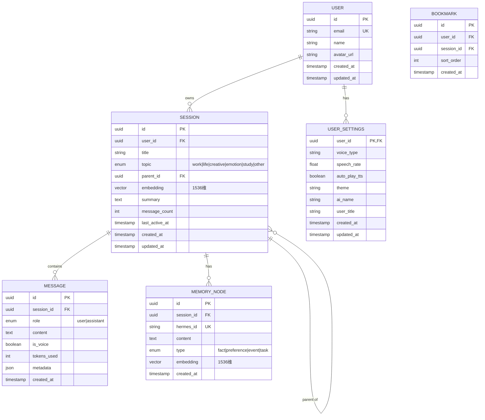

# 阿罗德斯 · 数据库 ER 图

> 版本：v1.0  
> 数据库：PostgreSQL + pgvector（向量扩展）+ Redis（缓存）

---

## 一、ER 图（Mermaid 语法）



---

## 二、表结构详细定义

### 2.1 users（用户表）

```sql
CREATE TABLE users (
    id UUID PRIMARY KEY DEFAULT gen_random_uuid(),
    email VARCHAR(255) UNIQUE NOT NULL,
    name VARCHAR(100) NOT NULL DEFAULT '愚者',
    avatar_url TEXT,
    created_at TIMESTAMP WITH TIME ZONE DEFAULT NOW(),
    updated_at TIMESTAMP WITH TIME ZONE DEFAULT NOW()
);

CREATE INDEX idx_users_email ON users(email);
```

| 字段 | 类型 | 约束 | 说明 |
|------|------|------|------|
| id | UUID | PK | 用户唯一标识 |
| email | VARCHAR(255) | UK, NOT NULL | 登录邮箱 |
| name | VARCHAR(100) | NOT NULL, DEFAULT '愚者' | 显示名称 |
| avatar_url | TEXT | - | 头像 URL |
| created_at | TIMESTAMP | DEFAULT NOW() | 创建时间 |
| updated_at | TIMESTAMP | DEFAULT NOW() | 更新时间 |

---

### 2.2 user_settings（用户设置表）

```sql
CREATE TABLE user_settings (
    user_id UUID PRIMARY KEY REFERENCES users(id) ON DELETE CASCADE,
    voice_type VARCHAR(50) DEFAULT 'female',
    speech_rate FLOAT DEFAULT 1.0 CHECK (speech_rate BETWEEN 0.5 AND 2.0),
    auto_play_tts BOOLEAN DEFAULT TRUE,
    theme VARCHAR(50) DEFAULT 'abyss',
    ai_name VARCHAR(100) DEFAULT '阿罗德斯',
    user_title VARCHAR(100) DEFAULT '愚者大人',
    created_at TIMESTAMP WITH TIME ZONE DEFAULT NOW(),
    updated_at TIMESTAMP WITH TIME ZONE DEFAULT NOW()
);
```

| 字段 | 类型 | 约束 | 说明 |
|------|------|------|------|
| user_id | UUID | PK, FK | 关联用户 |
| voice_type | VARCHAR(50) | DEFAULT 'female' | TTS 声音类型 |
| speech_rate | FLOAT | DEFAULT 1.0, CHECK 0.5-2.0 | 语速 |
| auto_play_tts | BOOLEAN | DEFAULT TRUE | 自动播放语音 |
| theme | VARCHAR(50) | DEFAULT 'abyss' | 主题 |
| ai_name | VARCHAR(100) | DEFAULT '阿罗德斯' | AI 称呼 |
| user_title | VARCHAR(100) | DEFAULT '愚者大人' | 用户称呼 |

---

### 2.3 sessions（会话表）⭐ 核心表

```sql
-- 启用 pgvector 扩展
CREATE EXTENSION IF NOT EXISTS vector;

CREATE TABLE sessions (
    id UUID PRIMARY KEY DEFAULT gen_random_uuid(),
    user_id UUID NOT NULL REFERENCES users(id) ON DELETE CASCADE,
    title VARCHAR(255) NOT NULL DEFAULT '新会话',
    topic VARCHAR(50) NOT NULL DEFAULT 'other' 
        CHECK (topic IN ('work', 'life', 'creative', 'emotion', 'study', 'other')),
    parent_id UUID REFERENCES sessions(id) ON DELETE CASCADE,
    embedding VECTOR(1536),  -- OpenAI text-embedding-3-small
    summary TEXT,
    message_count INTEGER NOT NULL DEFAULT 0,
    last_active_at TIMESTAMP WITH TIME ZONE DEFAULT NOW(),
    created_at TIMESTAMP WITH TIME ZONE DEFAULT NOW(),
    updated_at TIMESTAMP WITH TIME ZONE DEFAULT NOW()
);

-- 索引
CREATE INDEX idx_sessions_user_id ON sessions(user_id);
CREATE INDEX idx_sessions_parent_id ON sessions(parent_id);
CREATE INDEX idx_sessions_topic ON sessions(topic);
CREATE INDEX idx_sessions_last_active ON sessions(last_active_at DESC);

-- 向量相似度搜索索引（IVFFlat，适合1000+数据）
CREATE INDEX idx_sessions_embedding ON sessions 
    USING ivfflat (embedding vector_cosine_ops) 
    WITH (lists = 100);
```

| 字段 | 类型 | 约束 | 说明 |
|------|------|------|------|
| id | UUID | PK | 会话唯一标识 |
| user_id | UUID | FK, NOT NULL | 所属用户 |
| title | VARCHAR(255) | NOT NULL, DEFAULT '新会话' | 会话标题 |
| topic | VARCHAR(50) | NOT NULL, CHECK | 主题分类 |
| parent_id | UUID | FK, self-ref | 父会话（树形结构）|
| embedding | VECTOR(1536) | - | 语义向量，用于相似度搜索 |
| summary | TEXT | - | AI 生成的会话摘要 |
| message_count | INTEGER | NOT NULL, DEFAULT 0 | 消息数量 |
| last_active_at | TIMESTAMP | DEFAULT NOW() | 最后活跃时间 |
| created_at | TIMESTAMP | DEFAULT NOW() | 创建时间 |
| updated_at | TIMESTAMP | DEFAULT NOW() | 更新时间 |

**约束说明**：
- `parent_id` 自引用，支持无限层级（应用层限制3级）
- `embedding` 用于向量相似度搜索，找到语义相近的会话
- `topic` 决定前端星球颜色

---

### 2.4 messages（消息表）⭐ 核心表

```sql
CREATE TABLE messages (
    id UUID PRIMARY KEY DEFAULT gen_random_uuid(),
    session_id UUID NOT NULL REFERENCES sessions(id) ON DELETE CASCADE,
    role VARCHAR(20) NOT NULL CHECK (role IN ('user', 'assistant')),
    content TEXT NOT NULL,
    is_voice BOOLEAN DEFAULT FALSE,
    tokens_used INTEGER,
    metadata JSONB DEFAULT '{}',  -- 存储额外信息：audio_url, model, etc.
    created_at TIMESTAMP WITH TIME ZONE DEFAULT NOW()
);

CREATE INDEX idx_messages_session_id ON messages(session_id);
CREATE INDEX idx_messages_created_at ON messages(created_at DESC);
```

| 字段 | 类型 | 约束 | 说明 |
|------|------|------|------|
| id | UUID | PK | 消息唯一标识 |
| session_id | UUID | FK, NOT NULL | 所属会话 |
| role | VARCHAR(20) | NOT NULL, CHECK | user / assistant |
| content | TEXT | NOT NULL | 消息内容 |
| is_voice | BOOLEAN | DEFAULT FALSE | 是否语音输入 |
| tokens_used | INTEGER | - | Token 消耗 |
| metadata | JSONB | DEFAULT '{}' | 扩展字段 |
| created_at | TIMESTAMP | DEFAULT NOW() | 发送时间 |

**metadata 示例**：
```json
{
  "audio_url": "https://cdn.arodes.com/audio/xxx.webm",
  "model": "gpt-4o",
  "temperature": 0.7,
  "intent": { "type": "new_session", "params": {} }
}
```

---

### 2.5 memory_nodes（记忆节点表）

```sql
CREATE TABLE memory_nodes (
    id UUID PRIMARY KEY DEFAULT gen_random_uuid(),
    session_id UUID NOT NULL REFERENCES sessions(id) ON DELETE CASCADE,
    hermes_id VARCHAR(255) UNIQUE,  -- Hermes 系统中的记忆 ID
    content TEXT NOT NULL,
    type VARCHAR(20) NOT NULL CHECK (type IN ('fact', 'preference', 'event', 'task')),
    embedding VECTOR(1536),
    created_at TIMESTAMP WITH TIME ZONE DEFAULT NOW()
);

CREATE INDEX idx_memory_nodes_session_id ON memory_nodes(session_id);
CREATE INDEX idx_memory_nodes_type ON memory_nodes(type);
```

| 字段 | 类型 | 约束 | 说明 |
|------|------|------|------|
| id | UUID | PK | 本地记忆 ID |
| session_id | UUID | FK, NOT NULL | 来源会话 |
| hermes_id | VARCHAR(255) | UK | Hermes 中的记忆 ID |
| content | TEXT | NOT NULL | 记忆内容 |
| type | VARCHAR(20) | NOT NULL, CHECK | 记忆类型 |
| embedding | VECTOR(1536) | - | 语义向量 |
| created_at | TIMESTAMP | DEFAULT NOW() | 创建时间 |

**记忆类型说明**：
| 类型 | 示例 | 前端图标 |
|------|------|---------|
| fact | "用户明天下午3点开会" | 📋 |
| preference | "用户喜欢简短回答" | ❤️ |
| event | "用户上周完成了项目A" | 📅 |
| task | "用户需要调研竞品" | ✅ |

---

### 2.6 bookmarks（书签表）

```sql
CREATE TABLE bookmarks (
    id UUID PRIMARY KEY DEFAULT gen_random_uuid(),
    user_id UUID NOT NULL REFERENCES users(id) ON DELETE CASCADE,
    session_id UUID NOT NULL REFERENCES sessions(id) ON DELETE CASCADE,
    sort_order INTEGER NOT NULL DEFAULT 0,
    created_at TIMESTAMP WITH TIME ZONE DEFAULT NOW(),
    UNIQUE(user_id, session_id)
);

CREATE INDEX idx_bookmarks_user_id ON bookmarks(user_id);
CREATE INDEX idx_bookmarks_sort_order ON bookmarks(sort_order);
```

| 字段 | 类型 | 约束 | 说明 |
|------|------|------|------|
| id | UUID | PK | 书签 ID |
| user_id | UUID | FK, NOT NULL | 所属用户 |
| session_id | UUID | FK, NOT NULL | 收藏的会话 |
| sort_order | INTEGER | NOT NULL, DEFAULT 0 | 排序 |
| created_at | TIMESTAMP | DEFAULT NOW() | 收藏时间 |

---

## 三、关系说明

```
users (1) ──────< (N) sessions
    │                  │
    │                  ├── parent_id ──> sessions (自引用，树形)
    │                  │
    │                  ├──< (N) messages
    │                  │
    │                  └──< (N) memory_nodes
    │
    ├──< (1) user_settings
    │
    └──< (N) bookmarks
```

### 3.1 级联删除规则

| 父表操作 | 子表行为 |
|---------|---------|
| 删除 user | 级联删除所有 sessions, user_settings, bookmarks |
| 删除 session | 级联删除所有 messages, memory_nodes, 子 sessions |
| 删除 message | 不影响其他表 |
| 删除 memory_node | 不影响其他表 |

### 3.2 自引用约束（Session 树形结构）

```sql
-- 防止循环引用（可选，应用层处理更简单）
-- 或者使用递归 CTE 查询树

-- 查询某用户的会话树
WITH RECURSIVE session_tree AS (
    SELECT id, title, topic, parent_id, 0 as depth
    FROM sessions
    WHERE user_id = 'xxx' AND parent_id IS NULL

    UNION ALL

    SELECT s.id, s.title, s.topic, s.parent_id, st.depth + 1
    FROM sessions s
    JOIN session_tree st ON s.parent_id = st.id
    WHERE st.depth < 3  -- 限制3级
)
SELECT * FROM session_tree;
```

---

## 四、向量搜索示例

```sql
-- 找到与用户查询语义相似的会话
SELECT id, title, topic, 
       1 - (embedding <=> query_embedding) as similarity
FROM sessions
WHERE user_id = 'xxx'
ORDER BY embedding <=> query_embedding
LIMIT 5;

-- query_embedding 是用户输入文本的向量表示
-- <=> 是余弦距离运算符（pgvector 提供）
-- similarity 越接近 1 越相似
```

---

## 五、Redis 缓存设计

```
// 会话树缓存（过期 5 分钟）
key: "sessions:tree:{user_id}"
value: JSON.stringify(sessionTree)

// 用户设置缓存（过期 1 小时）
key: "settings:{user_id}"
value: JSON.stringify(userSettings)

// WebSocket 会话映射
key: "ws:session:{socket_id}"
value: { user_id, session_id }

// 速率限制
key: "rate_limit:{ip_address}"
value: 请求计数
expire: 60s
```

---

## 六、初始化数据

```sql
-- 创建默认用户（开发测试用）
INSERT INTO users (id, email, name) 
VALUES ('00000000-0000-0000-0000-000000000000', 'fool@arodes.com', '愚者');

-- 创建默认设置
INSERT INTO user_settings (user_id) 
VALUES ('00000000-0000-0000-0000-000000000000');

-- 创建主星球对应的"根会话"（不显示在列表中，仅作为树形根节点）
INSERT INTO sessions (id, user_id, title, topic)
VALUES ('home', '00000000-0000-0000-0000-000000000000', '阿罗德斯之心', 'other');
```
