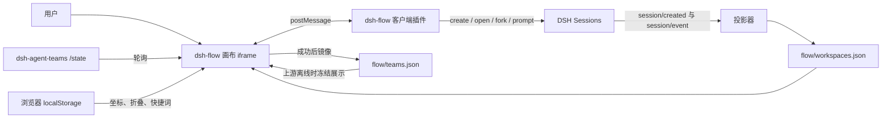
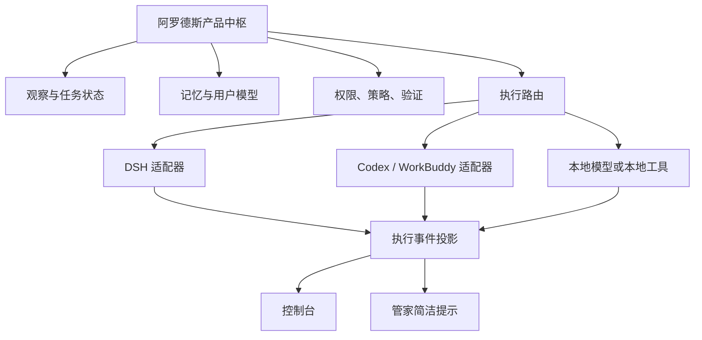

# dsh-flow 深度研究：它真正解决了什么，以及阿罗德斯该学什么

> 研究日期：2026-09-14  
> 研究对象：`rootkiller6788/dsh-flow`，检查提交 `68c4edd865b1c460278aaddffc73d727075815c0`  
> 用途：阿罗德斯后续架构决策与技术债记录；本报告不代表安装、接入或迁移决定。

## 结论先行

`dsh-flow` 不是任务编排器，也不是另一个 DSH。它是一个嵌入 DeepSeek Harness Web 界面的**可视化投影插件**：把 DSH 会话事件投影成对话时间轴，再把 `dsh-agent-teams` 的团队、成员、任务和消息快照画进同一张无限画布；用户从画布发起的新建、追问和分支仍由 DSH 原生会话执行。[1]

这一区分决定了它对阿罗德斯的价值：**适合学习它如何把复杂后台状态变成可理解的界面，不适合把它当作阿罗德斯的执行中枢、记忆系统或最小闭环基础。** 它没有替阿罗德斯解决屏幕感知、下一步建议、动作授权、执行后验证、本地/云端模型路由、管家与控制台通信等核心问题。

它反而支持我们此前的 DSH 边界判断：阿罗德斯保留产品状态、用户记忆、决策、权限和验证；DSH 作为可替换执行后端；类似 dsh-flow 的画布只能位于观察与交互层。官方 DSH 本身也是事件溯源、插件化、可替换服务的结构，Session 追加日志才是会话真相源，界面只是派生视图。[2][3]

当前不建议把 `dsh-flow` 装进阿罗德斯的开发主线。原因不是“插件方式不好”，而是它解决的问题晚于当前阶段：多智能体画布只有在多个真实并行任务已经造成理解困难时才产生价值。阿罗德斯现在应先跑通“看见状态 → 给一个动作 → 等待变化 → 验证结果”的最小流程。过早加入团队 DAG、角色立绘和消息流，会让界面显得进展丰富，却不提高任务完成率。

建议把它列为三个方向的参考样本：

1. **派生投影**：上游保留权威事件，界面维护可重建的读模型。
2. **界面减法**：复杂过程统一到一个视图，写入口收口到一张草稿卡，完整细节回到宿主查看。
3. **运行可解释性**：当阿罗德斯未来真正出现并行 Agent 时，用阶段、负责人、依赖、消息和结果证据解释“现在在做什么”。

在直接复用之前，至少要解决构建失败、零测试、跨进程覆盖、宿主接口脆弱耦合、团队与会话无法关联、认证边界以及素材来源确认问题。

## 1. 它是什么

项目自述是“DeepSeek Harness 的统一智能体画布”。它向 DSH 的 `conversation.view` 插槽注册一个标签页，以 iframe 加载自己的页面。画布同时呈现两类对象：[1][4][5]

- **会话轮次卡**：来自 DSH `sessions` 与 `workspaces`，按 fork 关系形成树。
- **团队层级区域**：来自 `dsh-agent-teams` 的实时状态，包含成员、任务、依赖和消息；获取成功后镜像到自己的快照文件。

用户可以在画布里选择会话、追问、分支、新建或隐藏节点。客户端桥接层再调用 DSH 的 `sessions.open()`、`sessions.fork()`、`sessions.create()` 和 `session.prompt()`。因此“画布执行任务”只是视觉入口，真正的会话生命周期、模型调用和工具执行仍在 DSH。[1][4]

更准确的定义是：

> dsh-flow = DSH 会话的派生读模型 + agent-teams 状态快照 + 画布渲染器 + 少量会话命令桥。

它不包含以下能力：

- 不拆解目标或决定是否启动团队；
- 不调度模型和显存；
- 不选择本地模型或云端模型；
- 不提供工具权限策略；
- 不验证任务是否真实完成；
- 不回滚失败操作；
- 不管理长期记忆；
- 不负责桌面观察与控制。

仓库名里的 `flow` 更接近“把工作流画出来”，而非“运行工作流”。

## 2. 实际架构与数据流



### 2.1 宿主侧

`index.js` 注入 DSH 的 `webServer` 和 `sessions` 服务，注册静态资源及 `/dsh-flow/map-api/*` 路由，监听 `session/created` 和 `session/event`，把会话变化投影到 `flow/workspaces.json`。[4]

投影会截断超长文本、限制标题和请求体，并使用“临时文件写入后 rename”的方式降低半写文件风险。它还有延迟合并写入，避免每个细小事件都立即落盘。这些是轻量本地插件中合理的工程选择。

### 2.2 客户端桥

`client.js` 负责注册 DSH 标签、跟随主题和语言、同步当前会话，并在 iframe 与宿主之间转发动作。消息使用固定 `source` 字段，双方校验同源；宿主侧还校验 `event.source` 是否为已登记 frame。[5]

这个桥让画布不必自己实现 DSH 会话协议。不过它也意味着插件与 DSH Web 客户端的插槽、服务名和 DOM 结构紧密绑定。

### 2.3 画布引擎

`engine.js` 把相机、平移缩放、视口裁剪、Bezier 连线与卡片拖拽从业务代码中分离。[6] 这是仓库中最值得借鉴、也最容易独立复用的部分。它遵循了正确边界：引擎只理解坐标、节点和边，不理解“会话”“成员”或“任务”。

### 2.4 团队数据

画布轮询 `/plugins/dsh-agent-teams/state`。上游存在时显示实时数据并写入 `flow/teams.json`；上游缺失时读取最后一次快照，所以历史仍可看，但不会继续变化。[1][7]

这里的“数据自有化”需要谨慎理解。dsh-flow 拥有的是**镜像快照**，并不拥有团队的真实运行状态。`dsh-agent-teams` 仍是活团队状态的来源；卸载它以后，dsh-flow 只剩静态展品。

### 2.5 浏览器本地数据

节点坐标、折叠状态、分支锚点和快捷词保存在 `localStorage`。会话 ID 和团队 ID 仍来自宿主。清浏览器缓存会丢布局，不会删除 DSH 会话。[1]

这个分层很合理：表现偏好留在浏览器，业务身份留在宿主。但快捷词已经带有用户输入语义，严格说不完全属于视觉元数据；未来若包含敏感常用语，需要单独考虑隐私和同步策略。

## 3. 与官方 DSH 的关系

官方 DeepSeek Harness 的基本思想是“所有部分都是插件”。模型适配器、工具注册、会话日志和 Agent loop 都由 Cordis 插件提供，profile 通过有序 bundle 与 patch 组合运行时。[2] `dsh-flow` 没有修改 DSH 核心，而是作为 out-of-tree bundle 安装到 `web` profile；这符合官方扩展方式。[8]

官方 DSH 的 Session 是追加式事件日志，消息历史由日志推导而来；持久层、投影层和 UI 可以替换。[3] dsh-flow 对会话做二次投影，因此它的数据应被视为缓存/读模型。只要可以从 DSH 日志重建，它就不应升级为权威状态。

官方 Web 连接层为 `/api` 使用随机启动令牌和签名 cookie，RPC 与事件流在派发前要求有效浏览器会话。[9] dsh-flow 的自有 `/dsh-flow` 路由不经过这层浏览器信任围栏，项目自己用 `Host` 白名单防 DNS rebinding。[1][4] 这在本机个人工具里可以降低一类攻击，但两者的安全语义不同：`Host` 校验证明“请求使用了允许的主机名”，不证明“请求来自已登录的 DSH 浏览器会话”。

此外，官方工作区与会话插件已有分组、搜索、fork、归档、排序等功能。[10] dsh-flow 的独特价值不是再次提供这些操作，而是把 fork 树、团队层级、成员对话和任务依赖放到一个空间视图里。

## 4. 做得好的设计

### 4.1 权威状态与显示状态分开

会话真身留在 DSH，团队活状态留在 agent-teams，dsh-flow 维护投影和快照。浏览器只保存布局。这个方向比把所有状态复制进一个“超级数据库”更清楚。

阿罗德斯可以学习同样的原则：

- 屏幕观察事实由观察日志拥有；
- 任务状态由阿罗德斯任务域拥有；
- DSH 执行日志由 DSH 拥有；
- 控制台只建立查询投影；
- 管家只显示当前需要用户知道的状态。

这样未来替换 DSH、UI 或本地模型时，不会连带迁移整个产品真相源。

### 4.2 复杂视图统一，但写操作克制

项目早期有两套画布，后来合并为一个通用引擎和一张图。会话与团队使用不同节点语义，却共享相机、裁剪、拖拽和连线。完整过程仍在 DSH 原生对话查看，画布只有一个草稿卡写入口。[1]

这是好的“合并”范例：合并共同交互与视觉基础，不强迫不同业务对象共享一个含糊的数据模型。

### 4.3 对上游离线状态给出明确降级

团队服务不存在时，它不伪造“实时”，而是使用冻结快照；两者都不存在时退化为纯会话时间轴。[1] 对阿罗德斯也应如此：Qwen3-VL 未启动时，控制台应显示“未观察/等待模型”，不能把旧截图结论当作当前状态。

### 4.4 提前清洗协议噪声

agent-teams 会把成员消息包装成带 UUID 与路由的文字信封。dsh-flow 在宿主投影时解析信封，旧数据再由客户端兜底解析，让用户看到“成员 A → 队长”而不是协议原文。[4][7]

这体现了有价值的适配层思想：外部执行器格式应在进入产品读模型时归一化，UI 不应到处解析供应商特有字符串。

### 4.5 没有为了性能引入 Rust

项目计划评估过 Rust，结论是宿主只提供静态文件与小型 JSON 存储，没有足够热点，当前不值得增加 Rust/WASM 工程链。这符合阿罗德斯“先完成最小流程，再按测量结果增加能力”的原则。[11]

## 5. 工程成熟度与实测结果

截至检查提交，仓库只有 5 个提交，全部集中在 2026-09-13，GitHub 显示 4 stars、0 fork、0 issue、无 release；`package.json` 写为 `0.3.0`，但没有对应 tag 或发布包。[1][12] 这不是质量否定，却意味着它仍是个人快速原型，不能根据版本号推断稳定性。

我在干净浅克隆后补全历史，并执行仓库脚本，得到：

| 检查 | 结果 | 含义 |
|---|---|---|
| `npm run build` | **失败** | 脚本检查不存在的根目录 `canvas.js`；实际文件为 `src/canvas.js`。[12] |
| `npm test` | 退出码 0，但 **0 tests / 0 suites** | “绿色”不代表行为得到验证；仓库没有 `test/` 目录。[1][12] |
| 手工 `node --check`：`index.js`、`client.js`、`engine.js`、全部 `src/*.js` | 通过 | 当前文件至少没有 JavaScript 语法错误。 |
| Git 历史 | 5 次提交、一天内完成 | 缺乏长期兼容性、迁移与故障恢复证据。 |

`prepare` 调用 `pnpm run build`。官方 DSH 文档说明，从 GitHub 安装、含 `prepare` 的源码插件会在安装阶段构建，而且 pnpm 10 需要显式允许构建脚本。[8] 因此当前错误不只是开发脚本不好看：它很可能阻断 README 推荐的 GitHub 安装路径。未经目标 DSH 版本上的真实安装验证，不能把它视为开箱即用。

## 6. 主要风险

### 6.1 单实例锁没有形成真正互斥

项目承认 `workspaces.json` 只支持单实例写入。[1] 源码风险比这句话更具体：`acquireLock()` 发现有效锁时只打印警告，随后保存流程仍继续写临时文件并 rename；`finally` 还会尝试删除锁文件。[4] 两个进程可能同时覆盖数据，其中一个进程还可能删掉另一个进程持有的锁。

这套存储可用于单机单 DSH 进程的原型，不适合作为阿罗德斯任务或记忆的权威存储。若将来只把它作为可重建投影，覆盖的后果较轻；若加入用户编辑的独有信息，就必须换为真正事务存储或带所有者标识的互斥机制。

### 6.2 团队与会话缺少稳定关联

README 明确说明团队快照没有记录“由哪个会话拉起”的关系，所以画布不能可靠连接团队与会话。[1] 这削弱了统一画布的核心叙事：用户能同时看见两种对象，却不能证明某个团队属于哪个需求、某个任务结果写回了哪次执行。

阿罗德斯未来如果展示执行过程，应从一开始保留稳定关联：`goalId → taskId → executionId → sessionId → evidenceId`。不能靠名称、时间接近或文本解析推断。

### 6.3 对文本信封的正则解析很脆弱

`src/relay.js` 与 `index.js` 通过固定英文前缀及符号匹配 `Agent <uuid> sent a message:`、`Background subagent ...` 等文本。[4][7] 上游改变措辞、UUID 格式、标点或本地化后，消息就会退化成普通文本。

这说明上游缺少稳定的结构化事件接口。正确长期方案是让 agent-teams 输出带类型、发送者 ID、接收者 ID、team ID 和 task ID 的事件；dsh-flow 只消费结构字段。阿罗德斯接 DSH 时也应使用结构化适配器，避免把控制台建立在自然语言日志上。

### 6.4 客户端耦合了另一个插件的 DOM

`client.js` 为了在画布激活时隐藏 agent-teams 原生 UI，使用 CSS 选择器匹配它的类名后缀，并在注释中承认前缀来自 bundle hash。[5] 即使后缀暂时稳定，这仍是跨插件内部 DOM 耦合。上游改组件或样式即可失效。

更稳的方式是 agent-teams 暴露正式的“隐藏原生面板”配置、slot 控制或客户端服务。没有契约时，阿罗德斯不应复制这种做法。

### 6.5 自有路由没有复用 DSH 浏览器会话认证

dsh-flow 的路由位于官方 `/api` 信任围栏之外，只做 Host 检查。[1][4] 静态资源风险较低，但其 API 包含清空投影、隐藏会话节点、添加消息和镜像团队等写操作。对仅监听 loopback 的个人应用，风险受到本机边界限制；如果将来允许局域网访问、反向代理或其他本机进程，这个保证不足。

接入前应让变更 API 进入 DSH 已认证 RPC/HTTP 层，或至少校验 DSH 浏览器会话、Origin/CSRF 令牌及方法级权限。仅添加 `trustedHosts` 不等于授权用户。

### 6.6 iframe 与宿主桥存在版本兼容成本

postMessage 的同源和 frame 来源校验做得合理，但插件仍依赖 DSH 的 `conversation.view` slot、sessions/workspaces 客户端服务以及会话对象方法。[5] 官方 DSH 当前仍处于预发布版本，agent-teams 也明确推荐锁定 DSH 与插件的精确兼容组合。[13] 三方版本一起变化时，dsh-flow 需要自己的兼容矩阵和集成测试。

### 6.7 自制 Markdown 只适合受控子集

项目使用先转义再做规则替换的轻量 Markdown 渲染器，降低了直接 HTML 注入风险，但它不是完整 CommonMark 实现。[14] 对 Agent 输出中的嵌套列表、复杂表格、链接括号、混合代码块等情况，显示可能与宿主不一致。若只做摘要卡可接受；若声称完整呈现执行记录，应复用宿主渲染或成熟解析器，并设置 URL 协议白名单。

### 6.8 素材与派生代码的来源需要确认

仓库采用 MIT 许可证，但 `src/artwork.js` 注明从 agent-teams 的 artwork 模块移植，`PLAN.md` 又记录了“隐藏上游面板并重建”“去标志化”等动机；15 张角色/动作 PNG 没有逐项来源和许可证说明。[11][15] 这不能证明侵权，但 MIT 根许可证本身不足以证明第三方素材可再分发。阿罗德斯若借鉴，只学习交互与架构思想，不复制图片或未确认来源的代码。

## 7. 对阿罗德斯最有价值的学习

### 7.1 做“执行观察器”，不要先做“多 Agent 大屏”

阿罗德斯最小界面只需要回答四个问题：

1. 当前目标是什么？
2. 现在做到哪一步？
3. 为什么等待或失败？
4. 用户下一步需要做什么？

dsh-flow 展示了未来扩展形态，但当前可先把每次执行投影成一条简洁记录：状态、执行器、开始时间、最后事件、验证结果。只有真实任务出现两个以上并行分支或依赖阻塞时，再增加 DAG。

### 7.2 建立统一执行事件协议

建议阿罗德斯未来的执行适配层输出最小结构：

```text
ExecutionEvent
  executionId
  taskId
  source        // dsh | codex | workbuddy | local
  type          // started | progress | waiting | action | evidence | completed | failed
  actorId?
  parentId?
  occurredAt
  summary
  payloadRef?
```

控制台根据事件生成读模型，管家只订阅与当前用户动作有关的摘要。这样 DSH 文案变化不会破坏 UI，本地模型也能进入同一观察面。

### 7.3 冻结快照必须带新鲜度

dsh-flow 的离线快照思路可用，但阿罗德斯应额外保存 `observedAt`、`sourceStatus` 和 `staleReason`。管家显示旧状态时必须明确“截至 14:32”，防止把历史结论说成当前事实。

### 7.4 将通用交互引擎与业务模型分离

如果以后确实需要画布，可学习 `engine.js` 的边界：相机和连线是基础设施，任务、观察、Agent、证据是业务对象。当前不需要提前复制画布代码；先让列表/时间线验证信息架构。

### 7.5 保留宿主深层入口

dsh-flow 不在画布重复完整对话，而是跳回 DSH 查看过程。这适合阿罗德斯：控制台显示摘要和证据，复杂调试可打开对应 DSH/Codex/WorkBuddy 会话。阿罗德斯不必重新实现每个执行器的专业界面。

### 7.6 多 Agent 应由任务证据触发

画布很容易诱导产品反向设计：为了让图丰富而创建更多 Agent。阿罗德斯应沿用从 Pi Agent 学到的原则：先由单执行器完成最小任务；只有出现可测量的上下文冲突、专业并行收益或独立复核需求，才启动第二个 Agent。UI 根据实际执行自然长出分支，而不是让用户先画组织结构。

## 8. 不建议照搬的部分

| dsh-flow 做法 | 阿罗德斯的处理 |
|---|---|
| 多智能体团队默认占据主画布 | 默认显示当前任务与唯一下一步；团队过程折叠为高级诊断。 |
| 正则解析上游自然语言信封 | 要求适配器输出结构化事件；原文只作审计附件。 |
| 单 JSON 保存投影和用户编辑 | 投影可重建；权威任务、权限和记忆进入各自数据库/日志。 |
| Host 白名单保护变更 API | 使用控制台身份、权限与动作审计；外部执行仍过 actionGate。 |
| CSS 隐藏另一个插件内部 UI | 通过正式配置、slot 或禁用插件客户端面板。 |
| 团队与会话靠视觉邻近 | 写入稳定 execution/session/team 关联 ID。 |
| 立绘承担主要身份识别 | 管家的角色形象只属于陪伴层；控制台用名称、职责、状态和证据。 |
| 自制 Markdown 展示完整输出 | 摘要使用受控富文本；完整内容交由宿主或成熟渲染器。 |

## 9. 是否改变此前的 DSH 决策

不改变，反而使边界更清晰。



`dsh-flow` 最多对应图中的“执行事件投影 + 控制台高级视图”，不应取代阿罗德斯产品中枢。若将来直接安装到 DSH，它仍只是 DSH 自己的诊断视图；阿罗德斯应通过适配器读取必要事件，而不是把产品状态反向托管给它。

“阿罗德斯自己改自己，还是让 DSH 改”也不会因 dsh-flow 改变。正确职责仍是：阿罗德斯提出受控变更请求、限定范围并持有审批与验收；DSH/Codex/WorkBuddy 负责在隔离工作区执行代码修改；验证通过后再由阿罗德斯记录版本与结果。dsh-flow 只能显示这段过程。

## 10. 建议路线

### 当前：只记录技术债

- 不安装 dsh-flow；
- 不把 Agent/Butler 界面改造成多 Agent 画布；
- 不迁移记忆或任务权威状态；
- 保留本报告作为控制台信息架构参考。

### 触发条件：满足后再做小型验证

至少同时出现以下两类证据，再考虑验证：

1. 阿罗德斯已跑通至少一种真实任务的“观察 → 建议/执行 → 验证”闭环；
2. 用户因为 DSH/Codex/WorkBuddy 并行执行而频繁不知道状态、归属或结果；
3. 单一时间线无法表达真实 fork/依赖；
4. DSH 和 agent-teams 的版本与接口已经锁定，并能在目标环境稳定安装。

### 第一项验证：不是接入 dsh-flow，而是验证投影原则

用一个只读适配器订阅单次 DSH 执行，生成 6 类事件：开始、进度、等待、动作、证据、结束。控制台先用普通时间线展示。验收条件是用户不打开 DSH，也能判断任务是否结束、为何失败、结果证据在哪里。

### 第二项验证：确有并行需求后再画 DAG

只选择一个真实的双分支任务，例如“实现 + 独立审查”。对比时间线与小型 DAG 是否让用户更快发现阻塞。若没有明显收益，继续使用列表，不引入无限画布。

### 若最终选择直接使用 dsh-flow

进入阿罗德斯环境前应完成以下门槛：

1. 修正 `package.json` 构建路径，并在全新 DSH web profile 上验证 GitHub 安装；
2. 增加投影、锁冲突、消息解析、postMessage 来源、路由权限和 DSH 版本兼容测试；
3. 将写 API 纳入 DSH 浏览器会话认证；
4. 用稳定结构事件替代中继文本正则；
5. 为 team/session 建立稳定关联；
6. 明确图片与移植模块的版权来源；
7. 锁定 DSH、agent-teams、dsh-flow 的完整 commit/version 组合；
8. 把 dsh-flow 数据明确标记为可重建投影，禁止承载阿罗德斯权威记忆与权限状态。

## 最终判断

`dsh-flow` 是一个方向明确、视觉表达有想法的早期 DSH 插件。它最好的贡献不是“画布很炫”，而是把后台会话、团队、任务和消息投影到统一观察面，并尽量保留宿主作为真相源。这个思想适合未来的阿罗德斯控制台。

它目前仍缺少成为稳定依赖所需的工程证据：推荐安装路径受构建脚本错误影响、测试实际为零、存储只适合单实例、跨插件契约脆弱、团队与会话关系缺失，安全与素材来源也需要补证。把它现在接进主线，收益小于引入的复杂度。

阿罗德斯当前应该借鉴它的**投影分层、冻结降级、单一写入口、通用引擎边界和过程可解释性**；拒绝照搬它的**默认多 Agent 画布、文本协议解析、单 JSON 权威化和内部 DOM 耦合**。等最小任务闭环跑通并出现真实的并行可视化需求后，再决定是实现一个更小的阿罗德斯执行时间线，还是把修复后的 dsh-flow 作为 DSH 专属诊断页。

## Sources

1. [rootkiller6788/dsh-flow README](https://github.com/rootkiller6788/dsh-flow)
2. [DeepSeek Harness Architecture](https://github.com/deepseek-ai/deepseek-harness/blob/master/docs/architecture.md)
3. [DeepSeek Harness Sessions](https://github.com/deepseek-ai/deepseek-harness/blob/master/docs/subsystems/session.md)
4. [dsh-flow 宿主插件 `index.js`](https://github.com/rootkiller6788/dsh-flow/blob/main/index.js)
5. [dsh-flow 客户端桥 `client.js`](https://github.com/rootkiller6788/dsh-flow/blob/main/client.js)
6. [dsh-flow 画布引擎 `engine.js`](https://github.com/rootkiller6788/dsh-flow/blob/main/engine.js)
7. [dsh-flow 中继解析 `src/relay.js`](https://github.com/rootkiller6788/dsh-flow/blob/main/src/relay.js)
8. [DeepSeek Harness CLI 与插件管理参考](https://github.com/deepseek-ai/deepseek-harness/blob/master/apps/cli/reference/README.md)
9. [DeepSeek Harness Web connection 与浏览器认证](https://github.com/deepseek-ai/deepseek-harness/blob/master/packages/client/connection/README.md)
10. [DeepSeek Harness Workspace UI](https://github.com/deepseek-ai/deepseek-harness/blob/master/packages/client/ui-workspace/README.md)
11. [dsh-flow 重构计划 `PLAN.md`](https://github.com/rootkiller6788/dsh-flow/blob/main/PLAN.md)
12. [dsh-flow `package.json`](https://github.com/rootkiller6788/dsh-flow/blob/main/package.json)
13. [NanmiCoder/dsh-agent-teams README 与兼容矩阵](https://github.com/NanmiCoder/dsh-agent-teams)
14. [dsh-flow Markdown 渲染器](https://github.com/rootkiller6788/dsh-flow/blob/main/src/markdown.js)
15. [dsh-flow 立绘映射模块](https://github.com/rootkiller6788/dsh-flow/blob/main/src/artwork.js)

