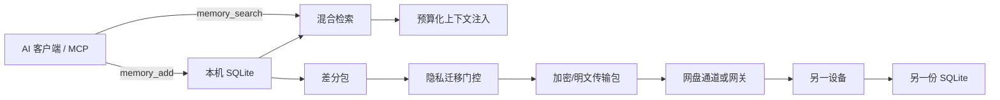

# MemoryBridge 与 PenguinHarness 深度研究

> 研究日期：2026-09-14  
> MemoryBridge：`jiabaobei/memory-bridge`，检查提交 `626dea514b68aca93815b66021bb71fa34077670`（v0.27.0）  
> PenguinHarness：`Prism-Shadow/penguin-harness`，检查提交 `cc00d2b7c74d51e122e571a872eeb6acaeced7cc`（源码版本 0.2.11）  
> 用途：阿罗德斯技术债与架构取舍；本报告不代表安装或接入决定。

## 结论先行

这两个项目分别覆盖阿罗德斯最容易重复建设的两个区域：

- **MemoryBridge** 是跨设备、跨 AI 客户端的外置记忆库与同步协议。它关注“同一条显式记忆如何安全地在设备之间移动和召回”。[1]
- **PenguinHarness** 是完整 Agent Harness，包含模型接入、ReAct 循环、工具、审批、沙箱、会话、Trace、记忆、技能、目标模式、多 Agent、评测和自进化。[2][3]

对阿罗德斯的建议很明确：

1. **MemoryBridge 当前不接入。** 阿罗德斯已经以 Obsidian/Hermes 作为可审计长期记忆源，Butler 还有活动日志与情景记忆原型。此时再加入 SQLite 图、向量、云盘差分、MCP 和预加载，会形成第三套记忆权威。先定义阿罗德斯到底“记什么、谁批准、如何纠错、何时使用”，比增加检索算法重要。
2. **PenguinHarness 当前不接入，也不取代 DSH。** 它是 DSH/Codex/WorkBuddy 同层的执行平台，不是管家或控制台组件。若同时接入，阿罗德斯将维护多套会话、技能、记忆、审批、沙箱和 Agent State。
3. **值得立刻吸收的是约束，不是代码。** MemoryBridge 的“显式写入、来源可见、召回可沉默、注入有预算”；PenguinHarness 的“极小核心工具、Trace 单一事实源、目标必须显式终止、能力由真实评测推动”。这些都支持用户已经确定的“先跑通最小流程，再按失败证据增加 skill”。
4. **MemoryBridge 的默认加密表述存在关键边界。** 默认 `channel.key` 与密文一起放在云盘通道里，能读取通道目录的一方同时拿到解密钥匙；只有用户额外提供、不随通道同步的 passphrase 才接近严格端到端保密。项目威胁模型实际承认了这一点，因此不能把默认模式理解为“网盘服务商只能看到无法解密的密文”。[4]
5. **PenguinHarness 的“自进化”不是模型神秘地自我成长。** 其公开示例主要是：执行 benchmark → 根据失败材料让 Agent 修改持久化 `AGENTS.md`/skill → 快照 → 再评测。[5] 这是受控的提示词与技能优化循环，价值在评测和版本化；风险也在于没有独立验证集时会过拟合，自动修改错误规则。

## 一、MemoryBridge

### 1. 它真正解决的问题

MemoryBridge 的产品目标不是自动理解全部人生，也不是自动总结所有聊天，而是把用户或宿主 Agent **显式写入的短记忆**保存在本地 SQLite 中，经检索和图关联后，通过网盘目录或网关在设备间同步。[1][6]

它的三项核心主张是：

- 记忆跟随用户跨设备与客户端；
- 热记忆可以提前同步和预加载；
- 记忆正文一旦写入就冻结，系统只改变向量、边、热度、标签和同步元数据，不自动重写正文。[1][6]

它提供三个主要 MCP 动作：添加、搜索、预加载。没有对正文的修改和删除工具。[1][7]



### 2. 数据模型

每条记忆节点包含原文、embedding、标签、场景、来源设备、迁移等级、置信度、创建和访问热度字段。关联边带权重、类型与简短证据。存储以 `nodes`、`edges`、`meta` 三个平面组织。[6][8]

同步不是复制整个数据库，而是发送差分包：以正文规范化后的指纹判断节点是否已存在，用序号和设备水位线诊断重复或乱序，接收端保持幂等；`migration=local` 的节点在构造差分前被过滤。[9]

这套模型的优点是简单、可解释、可以在普通电脑上运行。缺点是同正文被视为同一节点，内容冻结后缺少一等的“纠正、撤销、删除传播”语义；图边和热度并不能解决错误事实本身。

### 3. 检索与注入

检索由三路组成：

1. embedding 相似度；
2. 字符/关键词匹配；
3. 从命中种子扩展一跳图邻居。

三路结果用 RRF 按名次融合，而不是直接混合不同尺度的分数；输出还标注向量、关键词或图谱命中理由。[10] 注入层设置信心阈值和 token/字符预算，装不下的内容可退化为一行指针；没有足够强的结果时返回“不干预”。[1][11]

“沉默是一种结果”非常值得阿罗德斯采用。记忆系统最危险的行为不是少召回一条，而是每次都硬塞一条似乎相关的旧结论，污染当前判断。

### 4. 内容冻结的价值与代价

内容冻结阻止系统不断用 LLM 摘要覆盖原文，保留审计证据。这适合经验记录、用户明确偏好和任务交接卡。[6]

但“永不改写”不能等于“永不纠错”。真实个人记忆必然出现：

- 用户偏好改变；
- 旧计划取消；
- 错误事实被纠正；
- 敏感信息要求删除；
- 多设备写入互相矛盾。

MemoryBridge 当前可以通过新增一条更晚的记忆、交接卡替代和结构推导表达部分变化，但原记录仍存在。阿罗德斯若借鉴，应采用**不可变事件 + 可撤销状态**：原文不改，另写 `supersedes/retracts` 关系；召回默认排除已撤销版本；删除要求产生可跨设备传播的 tombstone，并明确备份保留期限。

### 5. 跨设备同步设计

项目用共享文件夹/网盘作为“邮局”：发送端先写临时文件再原子改名，接收端应用后归档；设备各写自己的心跳文件，减少共享可变文件冲突；通道 manifest 和 schema 指纹用于发现设备指向错误通道或数据库结构不兼容。[1][9]

这些设计值得学习：

- 每设备只写自己的状态；
- 数据包不可变；
- 应用操作幂等；
- schema/embedding 指纹不一致时拒绝静默合并；
- 环境错误保留重试，数据错误隔离。

但它并不是完整 CRDT。正文冲突主要靠指纹去重和追加收敛，没有对“同一个事实的两个版本”做业务仲裁。`seq` 水位线用于进度诊断，节点指纹才是主要幂等依据。[9]

### 6. 加密与隐私边界

项目提供迁移标签 `local/edge/cloud`、场景分类、敏感关键词降级和出口门控；差分包可用 Fernet 加密，密钥经 PBKDF2 从 passphrase 派生。[4][12]

最重要的现实边界是：为实现“新设备零输入”，v0.17 起默认把 `channel.key` 放入同一个网盘通道。威胁模型写明通道目录包含明文密钥，也说明能读取通道密钥的人能够解开 `wiring.json` 中的凭据；需要严格端到端时必须使用单独 passphrase。[4]

所以应区分两种模式：

| 模式 | 防止误看/普通文件扫描 | 防网盘提供方或完整通道泄露 |
|---|---:|---:|
| 默认通道密钥随目录同步 | 有一定作用 | **不能可靠保证** |
| 独立 passphrase，不随通道传输 | 可以 | 取决于口令强度和端点安全 |

此外，自动关键词判定敏感内容只能作为辅助。密码、病史、财务信息可以用任何表达方式出现；分类漏判后如果默认 `edge`，就会进入同步包。阿罗德斯不能把隐私出口完全交给关键词规则。

### 7. 工程成熟度与本机验证

检查版本有 51 个提交、v0.1.0 到 v0.27.0 的密集 tag、143 个自定义测试入口；核心坚持 Python 标准库零依赖，可选 MCP、OpenAI、网盘能力放入 extras。[1][13]

在当前机器 Python 3.14 环境运行 `python tests/run_tests.py`，结果是 **125/143 通过**。失败集中在：

- 引导接线测试的交互 mock 与当前问答流程不一致；
- Windows 上 POSIX cron 预期；
- rclone 缺失或测试未完全隔离外部 rclone；
- Windows 临时 SQLite 文件句柄未及时关闭，出现多次 `WinError 32` 清理警告；
- 若干 OneDrive/坚果云连接流程断言失败。

这不能直接等同于 18 个产品缺陷，其中一部分是运行环境与平台假设；但它证明 README 的“CI 3.9–3.13”边界很重要，当前 Python 3.14 不是已声明支持矩阵。更值得关注的是，网盘测试在缺少 rclone 时进入了本应 mock 的路径，跨平台和外部依赖隔离仍需加强。

### 8. 对阿罗德斯的取舍

MemoryBridge 与阿罗德斯现状存在四层重叠：

| MemoryBridge | 阿罗德斯现有/规划 |
|---|---|
| SQLite 记忆正文与元数据 | Obsidian 永久记忆、Hermes 和记忆决策文档 |
| 热度/混合检索/图边 | Hermes/既有检索与后续记忆架构技术债 |
| 交接卡 | Codex/WorkBuddy 任务交接与项目计划 |
| MCP 跨客户端共享 | Codex、WorkBuddy、DSH 的适配与共享记忆设想 |

现在接入会产生“哪一份才是真的”这一更难的问题。建议只吸收四条设计规则：

1. 记忆正文有来源、时间、作用域和置信度；
2. 没有高质量命中时保持沉默；
3. 注入必须有预算，先给指针再按需取全文；
4. 跨设备前必须经过显式迁移策略，且纠正/撤销能传播。

当阿罗德斯最小闭环完成、确实需要手机与 PC 共享记忆时，再用一小组明确事实做 MemoryBridge POC。届时应让 Obsidian 保持人类可读权威，MemoryBridge 只做可重建索引和传输层，或反过来明确迁移；不能长期双主。

## 二、PenguinHarness

### 9. 它是什么

PenguinHarness 是 TypeScript/pnpm monorepo。核心 `@prismshadow/penguin-core` 提供 ReAct 执行循环、OmniMessage 协议、模型与环境接口、Agent State 和 Trace；CLI、Server、Web、Desktop 是同一引擎的不同 Human 接口。[2][3]

运行层级是：

```text
Project → Agent → Workspace → Session → Task → Request
```

Project 持有模型与凭据配置，Agent 有持久状态，Workspace 是工具可见工作目录，Session 锁定 Agent/Workspace/模型，Task 对应一次目标，Request 是一次模型调用。[14]

这已经是完整执行平台，因此它和 DSH 的关系是“同层替代候选”，不是轻量插件。

### 10. 最值得学习的核心边界

官方架构用三个接口缩小核心：

- `LLMInterface`：模型输入输出；
- `EnvironmentInterface`：工具执行环境；
- Human/OmniMessage：用户输入、审批和流式输出。[3]

模型供应商适配下沉给 AgentHub，Web 只渲染 OmniMessage，Server 负责常驻、多用户、认证和持久运行，core 不持久化多用户状态。[3] 对阿罗德斯的启示是：模型路由、工具执行和人机交互不要互相直接引用具体实现，统一事件协议比“支持更多模型”更基础。

### 11. Trace 是真正的亮点

PenguinHarness 把完整 OmniMessage 作为 append-only JSONL Trace：模型输入、工具调用、审批、中断、请求结束和 token 用量都在同一个事件序列中。Trace 同时用于恢复、回放、UI、成本统计和审计，没有第二份会话事实源。[14]

实现还处理了几个常见但容易忽略的问题：

- 并行生产者的追加由写入器串行化；
- 每条记录一次底层 write，减少大行被拆开；
- 崩溃后的残缺末行可忽略并补换行；
- 只有 `request_end.status=completed` 的轮次被视为已提交；
- 子 Agent 有自己的 Trace，父 Trace只存指针；
- 上下文压缩轮转新文件，不篡改旧历史。[14]

阿罗德斯未来的任务执行审计很适合借鉴这种“执行事件日志 → 多个投影视图”，尤其是 `taskId/executionId/evidenceId` 的稳定关联。它比 dsh-flow 二次解析文本可靠。

### 12. Goal 模式与最小执行闭环

Goal 模式不是把无限循环写死在核心，而是由插件的 `user_prompt` 与 `stop` hooks 驱动。目标状态存入 Session scratchpad 的 `GOAL.json`，每轮结束读取状态并决定继续或停止。[15]

它规定 Agent 必须显式写出 `complete` 或 `blocked`；阻塞要连续三个轮次保持同一原因；预算耗尽会再给一个收尾轮；100 轮是硬兜底。用户中断优先于 hook。[15]

这套协议值得学习的不是“让 Agent 一直跑”，而是：

- 目标和普通消息分开；
- 完成必须由可读取状态声明；
- 预算是整个目标的资源边界；
- 中断、失败、阻塞、预算耗尽是不同终态；
- 状态文件损坏时 fail closed，停止循环。

但它仍依赖模型诚实写 `complete`。文档要求基于证据核验，协议本身却不能证明产物正确。阿罗德斯还需要独立 verifier 根据期望证据判断完成，不能只看 Agent 自报。

### 13. 记忆方式

PenguinHarness 的长期记忆比 MemoryBridge 简单：Agent State 下有 `memory/user` 和按 Workspace 划分的目录，每个 scope 用 `MEMORY.md` 作为可读索引；模型通过文件工具维护条目。服务端提供列表、变更预览、作用域迁移和 UI，但权威内容仍在文件层。[16][17]

优点是透明、Git 友好、无需额外向量数据库；缺点是“什么值得记、如何避免错误写入”主要依赖模型提示和用户审查。它适合项目规则、经验和少量长期事实，不自动解决大规模情景记忆检索。

这反而更贴近阿罗德斯当前需要：先把记忆写入、查看、纠正、使用的体验做清楚，再决定是否需要图检索和跨设备同步。

### 14. 技能、持续学习和自进化

PenguinHarness 把 Skill 作为 Agent State 中的可编辑目录，goal 与 continual-learning 由 hooks 提供。自进化示例创建 benchmark，多轮运行 Agent，收集失败报告，让 Agent读取失败与通过样例，然后修改自己的 `AGENTS.md`，再运行同一评分器比较 N、N+1、N+2。[5]

所以它的自进化链路是：


值得学习：

- 每轮前快照；
- 改动落在可读文件中；
- 用评分器决定保留或回退；
- 将“学习”限制为明确的持久规则/skill 变化。

需要警惕：

- 在同一 benchmark 上反复修改会过拟合；
- LLM 评分可能偏好格式而不是真实能力；
- 自动生成 skill 会扩大提示词和工具面；
- 若评测不覆盖安全，性能提高可能来自绕过约束；
- 公开 README 的“100 倍速度”“1/70 成本”属于项目方主张，benchmark 套件仍列为未公开路线图，暂时无法独立复现。[2]

这与用户对 Pi Agent 的理解非常接近，但要再加一个约束：**不是根据“想象中的任务”生成 skill，而是根据真实任务失败、独立验证集和回归测试生成最小规则。**

### 15. 审批和沙箱

工具审批支持 `allow-all`、`deny-all`、`read-only`、`always-ask`。每次工具调用读取当前模式；手动审批会挂起并经 SSE 发给前端；任务中断时待审批默认拒绝。[18]

沙箱采用 provider 接口，策略按调用传递，声明 `fs-write/network/mask-paths` 能力；提供者无法满足所需维度时必须失败，禁止悄悄退回未隔离命令。[19] 这是很好的 fail-closed 契约。

不过它的 README 路线图仍把 OpenShell 权限 shell 集成列为未来项；不同平台后端的隔离维度和完整性不完全一致。[2] 阿罗德斯不能仅因为界面显示“workspace-write”就假设网络、读权限和进程可见性都被隔离，必须记录具体 enforcement 证据。

### 16. 成熟度

检查提交时仓库约 2294 个文件，`packages`/`plugins` 范围约 1447 个文件，其中约 386 个测试文件；主 package 为 0.2.11，Node 要求 `>=24`，使用 lint、typecheck、Vitest、构建、E2E 和多平台发布流程。[20] GitHub 显示约 2.1k stars、222 forks，并有持续 release。[2][21]

这比 dsh-flow 和 MemoryBridge 更接近可用产品，但版本仍低于 1.0、功能迭代很快。仓库很大，本次没有安装整套 pnpm 依赖或执行全量测试，不能把源码结构审查当成运行验收。README 当前模型名称还包含明显面向未来/实验目录的条目，具体可用性必须以实际 provider 和 release 为准。

### 17. 与阿罗德斯、DSH 的重叠

| PenguinHarness | 阿罗德斯现有生态 |
|---|---|
| 模型 Provider/路由 | 阿罗德斯模型路由、DSH、各本地模型 |
| ReAct Agent loop | DSH/Codex/WorkBuddy 执行 |
| Skills/hooks | Codex skills、DSH plugins、阿罗德斯技能菜单 |
| Session/Trace | 阿罗德斯对话、DSH 会话、Codex task |
| Memory | Obsidian/Hermes、Butler 情景记忆 |
| Multi-agent | 已有研讨会、MetaGPT、未来 DSH |
| Self-evolution | 阿罗德斯自修改技术债 |
| Web/Desktop | Agent/控制台/管家界面 |

直接接入会增加第四套或第五套“任务是否完成”的状态。它更适合作为 DSH 的对照样本：以后若 DSH 在开放模型成本、Trace 可观测性、目标循环或自进化评测方面无法满足真实需求，再做同任务对照，而不是预先同时维护。

## 三、合并判断

### 18. 两个项目能否一起解决阿罗德斯记忆

技术上可以让 PenguinHarness 通过 MCP 调用 MemoryBridge，但产品上不建议现在这么做。PenguinHarness 已有自己的 `MEMORY.md` scope；MemoryBridge 又有 SQLite、图、向量和同步；阿罗德斯还有 Obsidian。三层叠加会产生：

- 重复内容；
- 冲突版本；
- 不同召回结果；
- 三套权限与删除路径；
- 无法解释一条建议究竟使用了哪份记忆。

如果未来真的组合，边界只能是：

```text
Obsidian/阿罗德斯记忆域 = 权威、可纠正的人类记录
MemoryBridge = 可重建的跨设备索引/运输层
PenguinHarness MEMORY.md = 某个执行 Agent 的私有操作经验
```

Agent 私有经验不能自动升级为用户事实；MemoryBridge 召回不能自动写回 Obsidian；阿罗德斯负责批准升格和记录来源。

### 19. 现在最应该借鉴的最小架构

无需安装任何一个项目，先在阿罗德斯未来记忆契约中保留六个字段：

```text
MemoryRecord
  id
  scope        // user | project | task | agent-private
  content
  source
  createdAt
  status       // active | superseded | retracted
```

召回接口只需要：

```text
recall(query, scope, budget) -> records + reasons + freshness
```

并遵守：无可靠结果时返回空；管家展示被使用的记忆来源；用户能纠正和撤销。向量、图、跨设备同步、自动 skill 提炼等都等真实规模和失败证据再加。

### 20. 开发优先级

1. **当前主线**：完成屏幕观察 → 下一步 → 验证闭环。
2. **最小记忆体验**：让用户看到阿罗德斯记住了什么、从哪里来，并能纠正/删除；先用现有 Obsidian/Hermes。
3. **执行审计**：借鉴 PenguinHarness Trace，统一 DSH/Codex/WorkBuddy 的执行事件和证据指针。
4. **跨设备触发后**：只有手机/PC 连续性成为真实需求，才评估 MemoryBridge 的同步层；默认密钥模式需重做或强制独立 passphrase。
5. **能力增长触发后**：只有重复真实失败可由一条专业规则解决，才生成 skill；必须用未参与生成的验证案例复测并可回滚。
6. **替代 Harness 触发后**：只有 DSH 经实测在关键指标上持续不足，才把 PenguinHarness 作为替代候选做同任务评测。

## 最终判断

MemoryBridge 最值得学习的是：记忆服务不负责编造内容、检索可以沉默、注入必须受预算约束、跨设备同步要幂等并在出口执行隐私门控。它当前最不适合阿罗德斯的是成为又一个权威记忆库；默认密钥随通道同步也不足以承担高敏感个人记忆的严格端到端保护。

PenguinHarness 最值得学习的是：少量底层接口、Trace 单一事实源、目标终态协议、失败关闭的沙箱能力声明，以及“评测—修改—快照—复测”的受控进化。它当前最不适合阿罗德斯的是整体接入，因为它与 DSH、Codex、WorkBuddy 和阿罗德斯自身能力大面积重叠。

两者共同给出的方向不是“再装两个系统”，而是把阿罗德斯进一步收敛：**产品真相只有一份；执行器可以替换；记忆可追溯、可纠正、按需召回；skill 只从真实失败中生长；完成必须有独立证据。**

## Sources

1. [MemoryBridge README](https://github.com/jiabaobei/memory-bridge)
2. [PenguinHarness README](https://github.com/Prism-Shadow/penguin-harness)
3. [PenguinHarness 架构总览](https://github.com/Prism-Shadow/penguin-harness/blob/main/packages/docs/content/architecture.zh.md)
4. [MemoryBridge 隐私威胁模型](https://github.com/jiabaobei/memory-bridge/blob/main/docs/threat-model.md)
5. [PenguinHarness 自进化示例](https://github.com/Prism-Shadow/penguin-harness/blob/main/examples/self-improving-agent/self-evolve.ts)
6. [MemoryBridge RFC-001 架构](https://github.com/jiabaobei/memory-bridge/blob/main/docs/RFC-001-architecture.md)
7. [MemoryBridge MCP Server](https://github.com/jiabaobei/memory-bridge/blob/main/src/membridge/mcp_server.py)
8. [MemoryBridge SQLite Store](https://github.com/jiabaobei/memory-bridge/blob/main/src/membridge/store.py)
9. [MemoryBridge 差分同步协议](https://github.com/jiabaobei/memory-bridge/blob/main/src/membridge/dss.py)
10. [MemoryBridge 混合检索](https://github.com/jiabaobei/memory-bridge/blob/main/src/membridge/retrieval.py)
11. [MemoryBridge 注入层](https://github.com/jiabaobei/memory-bridge/blob/main/src/membridge/injection.py)
12. [MemoryBridge 隐私门控](https://github.com/jiabaobei/memory-bridge/blob/main/src/membridge/privacy.py)
13. [MemoryBridge pyproject](https://github.com/jiabaobei/memory-bridge/blob/main/pyproject.toml)
14. [PenguinHarness Session 与 Trace](https://github.com/Prism-Shadow/penguin-harness/blob/main/packages/docs/content/sessions-and-traces.zh.md)
15. [PenguinHarness Goal 模式](https://github.com/Prism-Shadow/penguin-harness/blob/main/packages/docs/content/goal-mode.zh.md)
16. [PenguinHarness Memory State](https://github.com/Prism-Shadow/penguin-harness/blob/main/packages/core/src/state/memory.ts)
17. [PenguinHarness Memory Service](https://github.com/Prism-Shadow/penguin-harness/blob/main/packages/server/src/services/memory-service.ts)
18. [PenguinHarness 审批运行时](https://github.com/Prism-Shadow/penguin-harness/blob/main/packages/server/src/runtime/approvals.ts)
19. [PenguinHarness Sandbox 接口](https://github.com/Prism-Shadow/penguin-harness/blob/main/packages/core/src/plugin/sandbox.ts)
20. [PenguinHarness package.json](https://github.com/Prism-Shadow/penguin-harness/blob/main/package.json)
21. [PenguinHarness Releases](https://github.com/Prism-Shadow/penguin-harness/releases)

