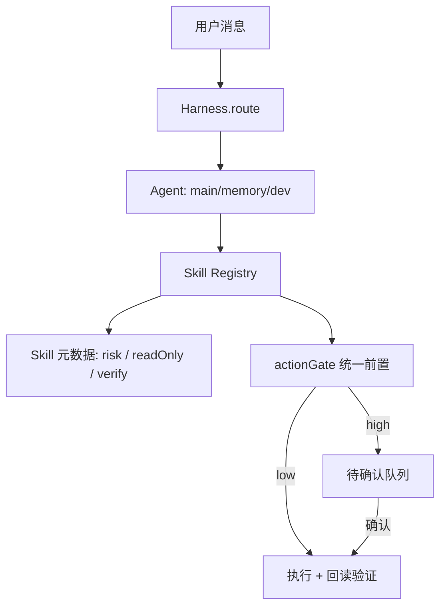

# 架构评审：基于 Harness 的统一工具授权与能力分层

> 日期：2026-08-13
> 触发：借鉴 Daisy-Voice-Agent，完善阿罗德斯架构。
> 范围：server 的 Harness / 技能注册表 / actionGate；不改变公开协议与行为基线。

## 1. 现状架构

阿罗德斯 server 以 Harness（多 Agent 编排）为中心：

```
WS message
  -> ws/handler.ts（显式记忆指令 -> 桌面确认 -> 意图路由）
  -> Harness.route(content) -> main | memory | dev
  -> Agent 流式 LLM -> <tool_call> 技能循环（<=3 轮）
  -> Skill Registry（全局 Map<name, AgentSkill>）
       |- builtin.ts：记忆/时间/会话/系统/TTS/文件/命令
       |- desktop.ts：winops 桌面操控（走 actionGate）
       |- mcp.ts：MCP 调用（走 actionGate）
       |- browser.ts / weather.ts / reminder.ts / devworkflow.ts / computer.ts / web.ts
  -> actionGate：低风险自动执行，高风险入待确认队列
```

关键文件：

- Arrodes/server/src/harness/harness.ts（Agent 注册/路由/重试/任务日志）
- Arrodes/server/src/skills/registry.ts（技能注册表 + tool_call 协议）
- Arrodes/server/src/skills/builtin.ts（内聚度最低，承载 6 类能力）
- Arrodes/server/src/services/actionGate.ts（分级授权）
- Arrodes/server/src/ws/handler.ts（确认短句直通执行）

## 2. 与 Daisy 的对照（含「文件操作」澄清）

Daisy 不是「没有文件操作」，而是文件操作以 LLM 工具调用形式存在，没有独立的文件管理界面，因此在功能宣传和浏览源码时容易被忽略。

证据（forestai123456/Daisy-Voice-Agent，main 分支）：

- src/main/llm/tools.ts 的 availableTools 明确定义：read_file、write_file、create_file、delete_file、list_directory、run_shell_command、download_media、scrape_url、trim_video、convert_video、convert_document、edit_document（.docx）、edit_pdf、get_clipboard_text、write_clipboard_text。
- src/main/control/macos.ts 的 executeTool 用 fs.readFileSync / fs.writeFileSync / fs.unlinkSync 真实实现，不是空壳。
- src/main/llm/system-prompt.ts 把文件工具压缩为一行「read_file / write_file / create_file / delete_file / list_directory：文件操作」，并附「文档/文件编辑规范」（编辑后回读验证、.docx 用 edit_document、PDF 用 edit_pdf）。

因此「感觉没有文件操作」的可能原因：

1. 文件能力完全由自然语言触发，没有可视化文件面板。
2. 在 45+ 个工具里只有一行描述，不突出。
3. README 把卖点放在「操控电脑、语音」，文件处理只占表格一行。
4. 若看的是旧版或其他 fork，文件工具可能更少。

Daisy 架构为扁平工具注册表：availableTools（一个 schema 数组）+ executeTool（macos.ts 里的超长 switch，约 1400 行），LLM 直接选工具。元数据用零散的 Set（SILENT_ACTION_TOOLS、INSPECTION_TOOLS、CONTINUE_AFTER_TOOLS）散落在 deepseek.ts。

阿罗德斯已有的 Harness 比 Daisy 更结构化（Agent 分层 + 技能注册表 + 意图路由），但技能注册表缺少元数据、风险规则未统一，是本次要补的架构缺口。

## 3. 架构债清单

| 级别 | 问题 | 证据 | 状态 |
|---|---|---|---|
| P1 | 风险规则散落：exec_command / write_file 用内联黑名单，绕过统一 actionGate，违背 D3=A 分级授权 | builtin.ts（exec/write 内联 blocklist）、actionGate.ts（RISK_RULES 只覆盖 desktop/mcp） | 已修复 |
| P2 | 技能注册表无 risk/readOnly 元数据，Harness 无法统一展示与执行策略 | registry.ts 的 AgentSkill 只有 name/description/args/execute | 已修复（S1） |
| P2 | exec_command 黑名单是字符串包含匹配，可被等价写法绕过 | builtin.ts runExecCommand | 已修复（S5） |
| P2 | builtin.ts 上帝模块：记忆/时间/会话/系统/TTS/文件/命令混在一个文件 | builtin.ts 约 400 行 | 已修复（S4） |
| P2 | 技能执行后无闭环回读验证，Daisy 有 read-after-write 校验 | harness/agents/main.ts 技能循环只注入结果 | 已修复（S2，技能层回读核验） |
| P3 | 无孤儿 tool_call 清理（Daisy cleanOrphanedTools 已处理） | harness/agents/main.ts 直接拼接历史 | 不适用（文本式 tool_call 协议） |
| P3 | 上下文固定取最近 10 条，长会话截断 | ws/handler.ts .slice(-10) | 设计行为，暂不处理 |

## 4. 目标架构

以 Harness 为唯一编排中心，把「能力」与「执行策略」解耦：



目标：

1. 技能注册表扩展元数据：risk（low/high）、readOnly、可选 verify(args, result)。
2. actionGate 成为所有有副作用技能的唯一执行前置；内联黑名单降级为执行器内部防线。
3. Agent 技能循环增加可选闭环验证：写操作后回读、命令后校验结果，失败则回报而不是谎称完成。
4. 按能力组拆分 builtin.ts（memory / file / command / utility），减少上帝模块。

## 5. 本次已实施

- actionGate.ts：风险规则集中补充命令与文件技能（exec_command/write_file/create_file/delete_file/move_file/copy_file 为 high；read_file/list_directory/get_file_info/minimax_tts 为 low）。
- skills/files.ts：新增完整文件操作技能族（list_directory / read_file / get_file_info / write_file / create_file / delete_file / move_file / copy_file），统一经 actionGate 分级授权。
- skills/builtin.ts：把 read_file / write_file 迁出到 files.ts（S4 拆分第一步），保留 exec_command；命令黑名单仍为执行器内部防线。
- server/src/index.ts：注册 files.ts，并让 GET /api/v1/skills 返回 risk 字段（S1 第一步，风险分级对 UI/调用方可观测）。
- registry.ts / files.ts：AgentSkill 增加 readOnly 元数据，文件技能标注只读/可写，GET /api/v1/skills 暴露 readOnly（S1 收尾）。
- skills/builtin.ts：exec_command 黑名单升级为结构化拦截（危险子串 + 命令动词精确匹配，含 .exe/.com 扩展名），避免 `echo shutdown` 等误伤并拦截 `format.com` 等绕过（S5）。
- skills/builtin.ts 按能力组拆分为 memory.ts / command.ts / utility.ts，移除死导入与无人使用的 loadProfile 重导出（S4）。
- skills/files.ts：写/建/删/移/复在返回前回读核验，失败即报「核验失败」而不是谎称完成（S2）。
- 测试：builtin.test.ts（exec 需确认）+ files.test.ts（只读自动执行、写操作需确认）。

效果：阿罗德斯具备完整文件操作能力，且命令与文件写操作和桌面操控、MCP 一致——高危先生成待确认项，回复「确认/取消」后经直通执行器处理，不再绕过授权模型。

## 6. 后续步骤（按风险从低到高）

- S1（完成）：AgentSkill 增加 readOnly 元数据，GET /api/v1/skills 暴露 risk/readOnly；risk 仍由 actionGate 单一来源派生。
- S3（不适用）：阿罗德斯用文本式 `<tool_call>` 协议，不持久化原生 tool_calls，跨轮无孤儿工具调用可清理。
- S5（完成）：exec_command 黑名单已升级为结构化危险模式匹配。
- S2（完成）：文件写操作在技能层回读核验（存在性 / 内容 / 大小），无需改 LLM 二次生成流程。
- S4（完成）：builtin.ts 已拆为 memory.ts / command.ts / utility.ts。

## 7. 验证证据与回滚

验证：Arrodes/server typecheck 通过；npx vitest run src 22 文件 / 131 用例全绿。

回滚：本改动为行为增强（文件写/命令执行由「直接执行」变为「确认后执行」）。若需恢复旧行为，回退 actionGate.ts 与 builtin.ts 中 exec_command/write_file 的相关改动即可；新增测试可保留或一并回退。

遗留风险：确认动作仍依赖用户回复短句；exec_command 结构化拦截仍属黑名单防御，不能替代确认授权；只读技能元数据当前仅标注 files 族，其余技能可按需补齐。

---

# 工作区模块架构评估（2026-08-15，improve-architecture）

## 现状

```
client/WorkspacePanel.tsx（~450 行：切换器/Agent 卡/聊天/任务/记忆/Obsidian/语音）
  └─ /api/v1/workspaces/*  → routes/workspaces.ts（CRUD/成员/聊天/任务/记忆 五类职责）
  └─ /api/v1/workspace/*   → routes/workspace.ts（概览/记忆/同步 Obsidian）
       services/：agentAdapters（注册表+适配器）、agentTasks、agentMemories、obsidianMemory、repoRoot
       db/：workspace-repo（含成员）、agent-chat-repo
       workspace/：memory-hub
```

依赖方向无循环：routes → services → db/workspace；client → routes。适配器 seam（Definition/Provider/Consumer）完整。

## 问题清单

| 级别 | 问题 | 证据 | 状态 |
|---|---|---|---|
| P2 | routes/workspaces.ts 上帝路由：CRUD + 成员 + 聊天 + 任务 + 记忆 五类职责混在一个文件 | routes/workspaces.ts ~250 行 | 待办 S2 |
| P2 | WorkspacePanel 上帝组件：切换器/Agent 卡/聊天/任务/记忆/Obsidian/语音全在一个组件 | WorkspacePanel.tsx ~450 行 | 待办 S3 |
| P3 | 已接入校验重复 3 次（chat/tasks/memories） | workspaces.ts | 已修（抽 isConnectedAgent） |
| P3 | repoRoot() 在 selfModify 与 workspaces 重复 | skills/selfModify.ts、routes/workspaces.ts | 已修（抽 services/repoRoot.ts） |
| P3 | 路由层无契约测试（supertest 未引入），核心逻辑靠 service/仓库层测试覆盖 | routes/* | 待办 S4 |

## 目标与重构步骤（按风险升序）

- S1（已做）：抽 `services/repoRoot.ts`、抽 `isConnectedAgent` helper——行为不变，测试通过。
- S2（结构性，需批准）：把 workspaces.ts 按职责拆为 `routes/workspaceMembers.ts`、`routes/workspaceAgents.ts`（聊天/任务/记忆），母路由挂载。
- S3（结构性，需批准）：把 WorkspacePanel 拆出 `AgentChatPanel.tsx`（聊天+任务+语音+记忆保存），面板只留切换器/Agent 卡/记忆。
- S4（低风险）：引入 supertest 给成员/聊天/任务/记忆路由补契约测试。

## 验证

server typecheck 通过；npx vitest run src 33 文件 / 166 用例全绿（S1 重构后行为不变）。
